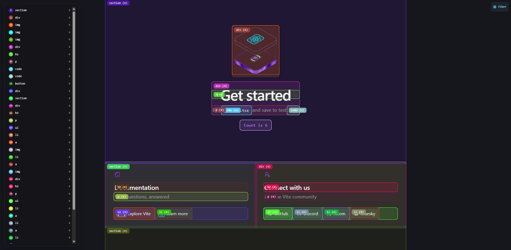

# fiber.js

### Single file React.js debug tool.

- **Visualize** Updates
- **Visualize** Draw Order
- **Visualize** Fiber Internals



## Usage

Open the `Developer Console` and paste the following snippet.

```js
document.head.append((s=document.createElement("script")).src="https://kokasmark.github.io/fiber.js/fiber.js",s)
```